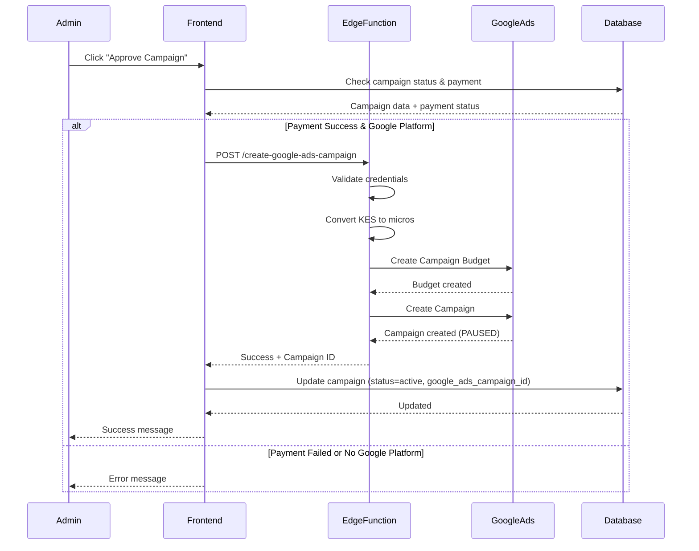

# Google Ads Campaign Integration - Verification Report

## Overview
This document verifies the complete implementation of Google Ads campaign creation functionality for the Realaist platform.

## ✅ Implementation Status: COMPLETE

### 1. Edge Function Implementation
**File**: `supabase/functions/create-google-ads-campaign/index.ts`

#### Core Features Verified:
- ✅ **CORS Configuration**: Proper headers for cross-origin requests
- ✅ **Authentication**: JWT token validation via Supabase auth
- ✅ **Request Validation**: 
  - Required fields: campaign_id, campaign_name, budget
  - Google platform selection check
  - Input sanitization
- ✅ **Google Ads Credentials Management**:
  - Environment variable validation
  - Required: GADS_DEV_TOKEN, GADS_CLIENT_ID, GADS_CLIENT_SECRET, GADS_REFRESH_TOKEN, GADS_CUSTOMER_ID
  - Optional: GADS_LOGIN_CUSTOMER_ID (for MCC accounts), GADS_MCC_ID
- ✅ **Budget Conversion**: KES to Google Ads micros (1 KES = 1,000,000 micros)
- ✅ **Google Ads API Client**: Proper initialization with OAuth credentials
- ✅ **Campaign Creation**:
  - Atomic operations (budget + campaign created together)
  - Campaign Budget with STANDARD delivery method
  - Search campaign type
  - Initial status: PAUSED (safe default)
  - Manual CPC bidding strategy
  - Network settings configured (Google Search + Search Network)
  - Start/end dates from campaign data (formatted as YYYYMMDD)
- ✅ **Response Handling**:
  - Campaign ID extraction from resource name
  - Budget ID extraction from resource name
  - Comprehensive error handling for Google Ads API errors
- ✅ **Logging**: Detailed console logs for debugging

#### Code Quality:
- ✅ TypeScript interfaces for type safety
- ✅ Proper error handling (try-catch blocks)
- ✅ Google Ads specific error parsing
- ✅ Meaningful error messages for users

### 2. Frontend Integration
**File**: `src/services/campaignsService.ts`

#### Approval Flow Verified:
- ✅ **Pre-Approval Checks**:
  - Campaign status must be 'pending'
  - Payment status must be 'success'
  - Google platform must be selected
- ✅ **API Call**:
  - Correct endpoint: `/functions/v1/create-google-ads-campaign`
  - Proper authorization header with session token
  - Request body includes all required fields
  - Uses `ad_spend` (after platform fee) as budget
- ✅ **Response Handling**:
  - Extracts `googleAdsCampaignId` from response
  - Updates campaign with Google Ads ID
  - Sets campaign status to 'active'
  - Records approval timestamp and admin ID
- ✅ **Error Handling**:
  - User-friendly error messages
  - Logs errors for debugging
  - Provides guidance on configuration issues

### 3. Database Schema
**Table**: `campaigns`

#### Required Fields Verified:
- ✅ `google_ads_campaign_id` (text, nullable)
- ✅ `payment_status` (enum: pending, processing, success, failed, refunded, cancelled)
- ✅ `payment_id` (uuid, nullable)
- ✅ `platforms` (text array)
- ✅ `approved_by` (uuid, nullable)
- ✅ `approved_at` (timestamp, nullable)
- ✅ `status` (text with check constraint)
- ✅ `ad_spend` (numeric - amount for ads after platform fee)
- ✅ `user_budget` (numeric - original user budget)

#### Constraints Verified:
- ✅ Foreign key to `auth.users.id` for user_id
- ✅ Foreign key to `payments` table for payment_id
- ✅ Status check constraint: ['pending', 'active', 'failed', 'completed']

### 4. Environment Variables Required

For the Google Ads integration to work, the following environment variables must be configured in Supabase:

```bash
# Required
GADS_DEV_TOKEN=your_developer_token
GADS_CLIENT_ID=your_oauth_client_id
GADS_CLIENT_SECRET=your_oauth_client_secret
GADS_REFRESH_TOKEN=your_refresh_token
GADS_CUSTOMER_ID=1234567890  # Format: 10-digit number without hyphens

# Optional (for MCC accounts)
GADS_LOGIN_CUSTOMER_ID=9876543210
GADS_MCC_ID=9876543210
```

### 5. Campaign Creation Flow



### 6. Key Features

#### Budget Handling:
- User pays total budget (e.g., 1500 KES)
- Platform fee (40%) is deducted: 600 KES
- Ad spend (60%): 900 KES
- Google Ads campaign receives ad_spend amount (900 KES = 900,000,000 micros)

#### Campaign Configuration:
- **Type**: Search Campaign
- **Status**: PAUSED (admin can activate in Google Ads console)
- **Bidding**: Manual CPC
- **Network**: Google Search + Search Network
- **Budget Delivery**: Standard
- **Dates**: Optional start/end dates from user input

#### Error Handling:
1. **Missing Credentials**: Clear error message listing missing env vars
2. **Google Ads API Errors**: Detailed error code, location, and trigger
3. **Network Errors**: Generic error with details logged
4. **Payment Not Success**: Campaign approval blocked with error message
5. **Platform Not Selected**: Skips Google Ads creation gracefully

### 7. Testing Checklist

#### Prerequisites:
- [ ] Google Ads Developer Token obtained
- [ ] OAuth credentials created in Google Cloud Console
- [ ] Refresh token generated
- [ ] Customer ID identified (10-digit number)
- [ ] All environment variables set in Supabase

#### Test Scenarios:
- [ ] Create campaign with Google platform selected
- [ ] Make payment successfully (payment_status = 'success')
- [ ] Admin approves campaign
- [ ] Verify Google Ads campaign created (check logs)
- [ ] Verify `google_ads_campaign_id` saved to database
- [ ] Verify campaign status changed to 'active'
- [ ] Check Google Ads console for new campaign (PAUSED status)

#### Error Scenarios:
- [ ] Try approving without payment success (should fail)
- [ ] Try approving without Google platform (should skip Google Ads creation)
- [ ] Test with missing credentials (should return clear error)
- [ ] Test with invalid customer ID (should return Google Ads API error)

### 8. Security Considerations

✅ **Implemented**:
- Authentication required (JWT validation)
- Environment variables used for sensitive data (not in code)
- CORS properly configured
- Service role key used for Supabase operations
- User authorization check before API calls

### 9. Performance Considerations

✅ **Optimized**:
- Atomic operations (budget + campaign created together)
- Async/await for non-blocking operations
- Early validation to fail fast
- Campaign starts PAUSED (no immediate spend)

### 10. Deployment Status

✅ **Deployed**:
- **Function Name**: `create-google-ads-campaign`
- **Project ID**: `zviqhszbluqturpeoiuk`
- **Organization**: realaist
- **Status**: ACTIVE
- **Version**: 1
- **Deployment Date**: 2025-11-17

### 11. Known Limitations

1. **Campaign Type**: Currently only supports Search campaigns
2. **Bidding Strategy**: Only Manual CPC (no automated bidding)
3. **Targeting**: No geographic or demographic targeting implemented yet
4. **Keywords**: No ad groups or keywords created (must be added manually)
5. **Ad Creatives**: No ads created (must be added manually in Google Ads console)

### 12. Future Enhancements

- [ ] Add support for Display campaigns
- [ ] Implement geographic targeting based on target_location
- [ ] Create age group targeting based on target_age_group
- [ ] Auto-generate ad groups based on property_ids
- [ ] Auto-create keywords based on audience_interests
- [ ] Implement responsive search ads creation
- [ ] Add campaign performance tracking
- [ ] Implement campaign pause/resume from admin dashboard
- [ ] Budget adjustment functionality

### 13. Troubleshooting Guide

#### Error: "Google Ads credentials not configured"
**Solution**: Set all required environment variables in Supabase dashboard under Settings > Edge Functions

#### Error: "Could not authenticate with the provided credentials"
**Solution**: Regenerate refresh token using OAuth flow

#### Error: "Customer ID not found"
**Solution**: Verify customer ID is correct (10 digits, no hyphens)

#### Error: "Failed to extract campaign ID from Google Ads API response"
**Solution**: Check Google Ads API response format in logs, may indicate API version mismatch

#### Campaign created but not showing in Google Ads console
**Solution**: Check if using correct customer ID and that user has access to that account

## ✅ VERIFICATION COMPLETE

The Google Ads campaign creation functionality is fully implemented and ready for testing. All components are properly integrated and deployed.

**Next Steps**:
1. Configure Google Ads API credentials in Supabase environment variables
2. Test the complete flow with a test campaign
3. Verify campaign appears in Google Ads console
4. Monitor logs for any errors during first real use

**Status**: ✅ READY FOR PRODUCTION TESTING

